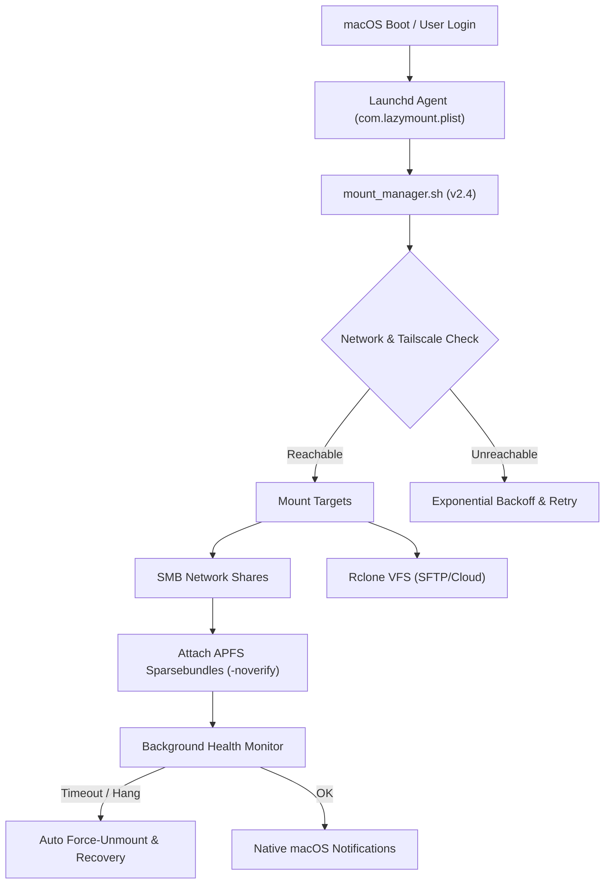

# LazyMount-Mac

[](https://opensource.org/licenses/MIT)
[](https://www.apple.com/macos/)

**[📖 中文文档](README_CN.md)**

> **Expand your Mac storage effortlessly** — Auto-mount SMB shares and cloud storage at boot, with zero manual intervention.

## Project Structure

.  
├──[README.md](README.md) — English Documentation  
├──[README_CN.md](README_CN.md) — Chinese Documentation  
├──[LICENSE](LICENSE) — MIT License  
├──[mount_manager.sh](mount_manager.sh) — Core script: Auto-mounts SMB/Rclone  
├──[mount_manager.example.local.sh](mount_manager.example.local.sh) — Example local config (copy to `mount_manager.local.sh`)  
├──[com.lazymount.plist](com.lazymount.plist) — LaunchAgent for mount script  
└──[com.ollama.startup.plist](com.ollama.startup.plist) — LaunchAgent for Ollama Service (AI)  


---

## Table of Contents

- [Why LazyMount?](#why-lazymount)
- [Installation](#installation)
  - [Prerequisites](#prerequisites)
  - [Install FUSE Interface](#fuse-install)
- [Configuration](#configuration)
- [Remote Access (Tailscale)](#remote-access-with-tailscale)
- [Use Case Examples](#use-case-examples)
- [Detailed Beginner's Guide](#detailed-beginners-guide)
- [FAQ / Troubleshooting](#faq)

---

<div align="center">
  
  <p><em>LazyMount-Mac runtime execution — network reachability check, credentials verification, and automated mount reconciliation</em></p>
</div>

---

## Why LazyMount?

Mac storage is **expensive** — a 1TB upgrade can cost $200+. LazyMount solves this by seamlessly extending your Mac with external storage:

- **[Game Libraries](#1-steam-game-library-on-nas)** — Store Steam/Epic games on a NAS, play them like local installs
- **[Time Machine Backups](#2-time-machine-to-remote-server)** — Back up to a remote server automatically
- **[Media Libraries](#3-media-server-plex-jellyfin)** — Access your movie/music collection stored on a home server
- **[Project Archives](#5-work-project-archives)** — Keep large files on cheaper storage, access them on-demand
- **[Cloud Storage](#4-google-drive-dropbox-as-local-folder)** — Mount Google Drive, Dropbox, or any rclone-supported service as a local folder
- **[AI Model Storage](#6-ai-llm-model-storage)** — Run large LLMs (Ollama) from network storage to save 100GB+ SSD space

**Key Features (v2.4):**
- **Auto-mount at login** — No manual clicking required
- **Self-healing** — Background health monitor detects unresponsive APFS volumes and auto-recovers (uses lightweight `df` checks, avoids false positives from APFS-over-SMB sync limitations)
- **Works anywhere** — Access home storage remotely via Tailscale
- **Dual-mode** — Supports both SMB (local) and Rclone (cloud/remote)
- **Fast APFS Mounting** — Bypasses slow network verification for 3x faster APFS attach times

---

## Architecture & Lifecycle



---

## Installation

### Prerequisites

1. **Rclone** (for cloud storage mounting):
   ```bash
   brew install rclone
   # Then configure your remote:
   rclone config
   ```


2. **<a id="fuse-install"></a>Install FUSE Interface** (Connection Layer):
   
   You need **ONE** of the following. **FUSE-T is recommended** for modern Macs (M1/M2/M3) as it doesn't require lowering system security.

   | Feature | **Option A: FUSE-T** (Recommended) | **Option B: macFUSE** (Legacy) |
   | :--- | :--- | :--- |
   | **Type** | User-space (NFS Bridging) | Kernel Extension (Kext) |
   | **Security** | ✅ **Safe** (No SIP changes) | **Low** (Must reduce security in Recovery Mode) |
   | **Stability** | ✅ High (Uses native macOS NFS) | Risk of kernel panics |
   | **Best for** | macOS 12+ / Apple Silicon (M-Series) | Intel Macs / Legacy software |

   **To install FUSE-T (Recommended):**
   ```bash
   brew tap macos-fuse-t/homebrew-cask
   brew install fuse-t
   ```

   **To install macFUSE (If you prefer Kexts):**
   ```bash
   brew install --cask macfuse
   ```

   <details>
   <summary><strong>⚠️ How to enable macFUSE on Apple Silicon (M1/M2/M3/M4...)</strong></summary>

   **Method 1: The Official Way (Recommended, keeps System Integrity Protection ON)**
   1. Shutdown your Mac.
   2. Press and hold the **Power Button** until "Loading startup options" appears.
   3. Click **Options** -> **Continue**.
   4. Menu bar: **Utilities** -> **Startup Security Utility**.
   5. Select your disk -> **Security Policy...**
   6. Choose **Reduced Security** and check **"Allow user management of kernel extensions..."**.
   7. Restart -> System Settings -> Privacy & Security -> Allow "Benjamin Fleischer".
   8. Restart again.

   **Method 2: The Terminal Way (NOT Recommended, disables SIP)**
   *You might see tutorials suggesting `csrutil disable` in Recovery Terminal. While this works, it completely disables macOS security protections. Method 1 is safer.*
   </details>
   <br>

3. **(Recommended) Tailscale** — For remote access to home network:
   ```bash
   brew install --cask tailscale
   ```

### Quick Start

```bash
# 1. Clone the repository
git clone https://github.com/yuanweize/LazyMount-Mac.git
cd LazyMount-Mac

# 2. Copy script to your Scripts folder
mkdir -p ~/Scripts
cp mount_manager.sh ~/Scripts/
chmod +x ~/Scripts/mount_manager.sh

# 3. (Recommended) Create local config file to avoid modifying the main script
cp mount_manager.example.local.sh ~/Scripts/mount_manager.local.sh
nano ~/Scripts/mount_manager.local.sh  # Edit with your settings

# 4. Install LaunchAgent for auto-start
cp com.lazymount.plist ~/Library/LaunchAgents/com.lazymount.plist
# Edit the plist to use your username:
sed -i '' "s/YOUR_USERNAME/$(whoami)/g" ~/Library/LaunchAgents/com.lazymount.plist

# 5. Load the LaunchAgent service
launchctl load ~/Library/LaunchAgents/com.lazymount.plist
```

---

## <a id="configuration"></a>⚙️ Configuration

Configuration is managed through a **local config file** (`mount_manager.local.sh`) that overrides the default settings in `mount_manager.sh`. This approach keeps your settings separate from the main script, making updates easier.

### Using Local Config File (Recommended)

The script automatically loads `mount_manager.local.sh` from the same directory if it exists. This allows you to:
- Keep your settings separate from the main script
- Update `mount_manager.sh` without losing your configuration
- Track changes to the main script via git while ignoring your local config

**Setup:**

```bash
# Copy the example config
cp mount_manager.example.local.sh ~/Scripts/mount_manager.local.sh

# Edit with your settings
nano ~/Scripts/mount_manager.local.sh
```

**Example `mount_manager.local.sh`:**

```bash
# --- Global Settings ---
# AUTO_UPDATE_ENABLED="true"                     # Set to "false" to disable auto-update

# --- Rclone Configuration ---
RCLONE_REMOTE="myremote:/path/to/folder"
RCLONE_MOUNT_POINT="$HOME/Mounts/CloudStorage"
RCLONE_IP="100.x.x.x"                            # Tailscale IP or 8.8.8.8

# --- SMB Configuration ---
SMB_IP="192.168.1.100"                           # Tailscale IP for remote access
SMB_USER="your_username"
SMB_SHARE="SharedFolder"

# --- Sparse Bundle (Optional) ---
BUNDLE_PATH="/Volumes/$SMB_SHARE/my_secure_disk.sparsebundle"
BUNDLE_VOLUME_NAME="MyPrivateDisk"
```

### Direct Configuration (Alternative)

You can also edit `mount_manager.sh` directly, but be aware that updates may overwrite your changes.

```bash
nano ~/Scripts/mount_manager.sh
```

Locate the **DEFAULT CONFIGURATION** section to adjust settings.

### Rclone Advanced Configuration

Rclone mount flags are defined in the `RCLONE_MOUNT_ARGS` array. You can add, remove, or modify flags in this array to customize the mount behavior.

```bash
# In mount_manager.sh:

RCLONE_MOUNT_ARGS=(
    "--volname" "CloudStorage"
    "--vfs-cache-mode" "full"
    "--vfs-cache-max-size" "20G"
    "--no-modtime"
    # Add custom flags here
)
```

### SMB Share Settings

```bash
SMB_ENABLED="true"
SMB_IP="192.168.1.100"           # Your NAS/Server IP
SMB_USER="your_username"         # SMB username
SMB_SHARE="SharedFolder"         # Share name
```

### Rclone Settings

```bash
RCLONE_ENABLED="true"
RCLONE_REMOTE="myremote:/path"   # Your rclone remote
RCLONE_MOUNT_POINT="$HOME/Mounts/Cloud"
RCLONE_IP="100.x.x.x"            # IP to ping (use Tailscale IP for remote)
```

### Sparse Bundle (Optional)

For mounting disk images stored on the SMB share:

```bash
BUNDLE_PATH="$SMB_MOUNT_POINT/Storage.sparsebundle"
BUNDLE_VOLUME_NAME="ExternalStorage"
```

### Auto-Update

The script can automatically check for updates from GitHub on each startup.

```bash
AUTO_UPDATE_ENABLED="true"    # Set to "false" to disable
```

When enabled, the script will:
1. Fetch the latest version from GitHub on startup
2. Compare the remote `SCRIPT_VERSION` with the local version
3. If a new version is available, download and replace the script automatically
4. Save a backup as `mount_manager.sh.backup` before updating

> **Note:** After an update, the script logs a message to restart. The new version takes effect on the next launch.

---

## Remote Access with Tailscale

LazyMount works beautifully with [Tailscale](https://tailscale.com/) for accessing your home storage from anywhere.

### Setup Overview

```
┌─────────────────────────────────────────────────────────────┐
│                     YOUR HOME NETWORK                       │
│                                                             │
│    ┌───────────────┐        ┌───────────┐   ┌───────────┐   │
│    │   Tailscale   │───────▶│    NAS    │   │  Server   │   │
│    │ Subnet Router │        │ (SMB/AFP) │   │ (SSH/Web) │   │
│    └───────────────┘        └───────────┘   └───────────┘   │
│           │                                       ▲         │
│           └───────────────────────────────────────┘         │
└──────────────────────────────▲──────────────────────────────┘
                               │
                      Tailscale VPN Tunnel
                               │
┌──────────────────────────────┴──────────────────────────────┐
│                    ANYWHERE IN THE WORLD                    │
│                 ┌─────────────────────────┐                 │
│                 │       Your MacBook      │                 │
│                 │   (LazyMount Client)    │                 │
│                 └─────────────────────────┘                 │
└─────────────────────────────────────────────────────────────┘
```

### Exit Node Configuration (Subnet Routing)

The magic feature you're looking for is called **"Subnet Router"** or **"Exit Node"** in Tailscale:

1. **On your home server** (Linux example):
   ```bash
   # Enable IP forwarding
   echo 'net.ipv4.ip_forward = 1' | sudo tee -a /etc/sysctl.conf
   sudo sysctl -p
   
   # Advertise your home subnet
   sudo tailscale up --advertise-routes=192.168.1.0/24
   ```

2. **In Tailscale Admin Console** (https://login.tailscale.com/admin):
   - Go to Machines → Your server → Enable "Subnet routes"
   - Approve the `192.168.1.0/24` route

3. **On your Mac** (the client):
   ```bash
   # Accept the advertised routes
   sudo tailscale up --accept-routes
   ```

Now your Mac can access `192.168.1.x` addresses even when you're at a coffee shop! 🎉

---

## Use Case Examples

### 1. Steam Game Library on NAS

Store games on a NAS to save SSD space:

```bash
# In mount_manager.sh:
SMB_IP="192.168.1.50"        # NAS IP
SMB_USER="steam"             
SMB_SHARE="Games"            # Share containing Steam library

# Optional: Use sparse bundle for better performance
BUNDLE_PATH="/Volumes/Games/SteamLibrary.sparsebundle"
BUNDLE_VOLUME_NAME="SteamLibrary"
```

> **⚠️ Gaming Note:**
> *   Steam/Epic games **require** an APFS Sparse Bundle to work correctly.
> *   **League of Legends (LOL)** does not support running from network drives (even inside APFS).


Then in Steam: Settings → Storage → Add Library Folder → `/Volumes/SteamLibrary`

### 2. Time Machine to Remote Server

Back up your Mac to a server over the network:

```bash
SMB_IP="192.168.1.10"
SMB_USER="timemachine"
SMB_SHARE="Backups"

BUNDLE_PATH="/Volumes/Backups/MyMac.sparsebundle"
BUNDLE_VOLUME_NAME="TimeMachine"
```

Then: System Settings → Time Machine → Select Disk → Choose "TimeMachine"

### 3. Media Server (Plex Jellyfin)

Access your movie library stored on a home server:

```bash
RCLONE_ENABLED="true"
RCLONE_REMOTE="homeserver:/media"
RCLONE_MOUNT_POINT="$HOME/Movies/Server"
RCLONE_IP="100.64.0.1"       # Tailscale IP of your server
```

### 4. Google Drive Dropbox as Local Folder

Mount cloud storage as if it were a local drive:

```bash
# First, configure rclone:
# rclone config → New remote → "google" → Google Drive

RCLONE_REMOTE="google:/MyDrive"
RCLONE_MOUNT_POINT="$HOME/GoogleDrive"
RCLONE_IP="8.8.8.8"          # Use Google DNS to check internet
```

### 5. Work Project Archives

Keep large project files on office NAS, access from home:

```bash
SMB_ENABLED="true"
SMB_IP="10.0.0.50"           # Office NAS (via VPN/Tailscale)
SMB_USER="employee"
SMB_SHARE="Projects"
```

### 6. AI LLM Model Storage

Store large language models (LLaMA, Mistral, Qwen, etc.) on a server instead of your Mac's limited SSD:

```bash
RCLONE_ENABLED="true"
RCLONE_REMOTE="homeserver:/ai-models"
RCLONE_MOUNT_POINT="$HOME/.ollama/models"    # Ollama's model directory
RCLONE_IP="192.168.1.10"
```

**⚠️ Important: Network Speed Matters!**

LLM models need to be loaded into RAM before inference. If your model isn't in local cache, it must be transferred over the network. A 70B model can be 40GB+, so network speed is crucial:

| Network Type | Speed | Time to Load 40GB Model |
|--------------|-------|-------------------------|
| 1 Gigabit (1G) | ~120 MB/s | ~5.5 minutes |
| **2.5 Gigabit (2.5G)** | ~300 MB/s | **~2.2 minutes** ✅ Recommended (Mac Mini default) |
| 10 Gigabit (10G) | ~1.2 GB/s | ~33 seconds |

**Hardware Recommendations:**

```
┌─────────────────────────────────────────────────────────────────┐
│  💡 For Best LLM Experience, Upgrade Your Network!              │
├─────────────────────────────────────────────────────────────────┤
│                                                                 │
│  Option 1: 2.5G USB Adapter (~$15-30)                          │
│  ┌─────────┐      ┌─────────────────┐      ┌─────────────┐     │
│  │   Mac   │─USB─▶│ 2.5G USB Adapter │─────▶│ 2.5G Switch │     │
│  └─────────┘      └─────────────────┘      └─────────────┘     │
│                                                                 │
│  Option 2: 10G Thunderbolt Adapter (~$100-200)                 │
│  ┌─────────┐      ┌───────────────────┐    ┌─────────────┐     │
│  │   Mac   │─TB4─▶│ 10G TB Adapter    │───▶│ 10G Switch  │     │
│  └─────────┘      └───────────────────┘    └─────────────┘     │
│                                                                 │
│  ⚠️ Both sides (Mac + Server) must support the speed!          │
└─────────────────────────────────────────────────────────────────┘
```

**Cache Settings for LLM (minimize re-downloads):**

```bash
# In mount_manager.sh, adjust Rclone settings:
--vfs-cache-max-size 100G    # Large cache for model files
--vfs-cache-max-age 720h     # Keep cached for 30 days
--vfs-read-ahead 1G          # Pre-fetch for faster loads
```

**Why this matters:**
- LLM apps (Ollama, LM Studio) unload models after idle time (typically 5 minutes)
- Next query requires reloading the full model from network
- Fast network = quick model loading = better experience

### Ollama Service Setup (Optional)

If you want Ollama to start automatically at boot and serve models from your network drive (0.0.0.0), use the provided plist:

1. **Edit the plist:**
   Open `com.ollama.startup.plist` and change `/Users/YOUR_USERNAME/.ollama/models` to your actual mount path (e.g., `/Users/yuanweize/Mounts/Server/ai-models`).

2. **Install:**
   ```bash
   cp com.ollama.startup.plist ~/Library/LaunchAgents/
   launchctl load ~/Library/LaunchAgents/com.ollama.startup.plist
   ```

3. **Verify:**
   Ollama will now start largely and listen on all interfaces. Access it from other devices via `http://YOUR_MAC_IP:11434`.

---

## Detailed Beginner's Guide

New to terminal/command line? This section walks you through everything step-by-step.

### Step 1: Install Homebrew (Package Manager)

Homebrew is like an "App Store" for command-line tools. If you don't have it:

```bash
# Open Terminal (Spotlight → type "Terminal" → Enter)
# Paste this command and press Enter:
/bin/bash -c "$(curl -fsSL https://raw.githubusercontent.com/Homebrew/install/HEAD/install.sh)"

# Follow the on-screen instructions
# When done, verify with:
brew --version
```

### Step 2: Install Required Tools

```bash
# Install Rclone (for cloud/remote mounting)
brew install rclone

# Install FUSE-T (Recommended for M-Series Macs)
# It's newer, faster, and safer (no reboot required!)
brew tap macos-fuse-t/homebrew-cask
brew install fuse-t

# --- OR ---

# Install macFUSE (Legacy, for Intel or specific needs)
# ⚠️ Apple Silicon users will need to enable Kernel Extensions in Recovery Mode
brew install --cask macfuse
```

**If you installed FUSE-T:**
You are done! No restarts or security changes needed.

**If you installed macFUSE:**
1. Go to System Settings → Privacy & Security
2. Click "Allow" for the system extension
3. **Restart your Mac**

### Step 3: Configure Rclone Remote

```bash
# Start the configuration wizard
rclone config

# Example: Setting up SFTP connection to your server
# n) New remote
# name> homeserver
# Storage> sftp
# host> 192.168.1.10
# user> your_username
# (follow prompts for SSH key or password)
```

**Common remote types:**

| Type | Use Case | Command |
|------|----------|---------|
| SFTP | Linux servers, NAS with SSH | `rclone config` → sftp |
| Google Drive | Google cloud files | `rclone config` → drive |
| Dropbox | Dropbox files | `rclone config` → dropbox |
| S3 | AWS/MinIO storage | `rclone config` → s3 |

### Step 4: Test Your Remote

```bash
# List files on your remote (replace 'homeserver' with your remote name)
rclone ls homeserver:/

# If you see your files, it's working!
```

### Step 5: Download and Configure LazyMount

```bash
# Create Scripts folder
mkdir -p ~/Scripts

# Download the script
curl -o ~/Scripts/mount_manager.sh https://raw.githubusercontent.com/yuanweize/LazyMount-Mac/main/mount_manager.sh

# Make it executable
chmod +x ~/Scripts/mount_manager.sh

# Open in TextEdit
open -e ~/Scripts/mount_manager.sh
```

**In the script, find and edit these lines:**

```bash
# === RCLONE SETTINGS ===
RCLONE_ENABLED="true"                          # Enable Rclone? (true/false)
RCLONE_REMOTE="homeserver:/data"               # ← Your remote name and path
RCLONE_MOUNT_POINT="$HOME/Mounts/Server"       # ← Where to mount on your Mac
RCLONE_IP="192.168.1.10"                       # ← IP to ping for network check

# === SMB SETTINGS ===
SMB_ENABLED="true"                             # Enable SMB? (true/false)
SMB_IP="192.168.1.100"                         # ← Your NAS/Server IP
SMB_USER="your_username"                       # ← Your SMB username
SMB_SHARE="SharedFolder"                       # ← Share folder name
```

### Step 6: Save SMB Password to Keychain

**This is important!** The script needs your password stored in Keychain:

1. Open **Finder** → Press `⌘ + K` (Connect to Server)
2. Type: `smb://your_username@192.168.1.100/SharedFolder`
3. Enter your password
4. ✅ Check **"Remember this password in my keychain"**
5. Click Connect

The script will now connect using the stored credentials.

### Step 7: Test the Script Manually

```bash
# Run the script to see if it works
~/Scripts/mount_manager.sh

# Watch the log in real-time (open a new terminal window)
tail -f /tmp/mount_manager.log

# You should see:
# === Mount Session Started: ... ===
# HH:MM:SS [SMB] Starting sequence...
# HH:MM:SS [SMB] Network OK.
# ...
```

### Step 8: Set Up Auto-Start at Login

```bash
# Download the LaunchAgent plist
curl -o ~/Library/LaunchAgents/com.lazymount.plist https://raw.githubusercontent.com/yuanweize/LazyMount-Mac/main/com.lazymount.plist

# Replace YOUR_USERNAME with your actual username
sed -i '' "s/YOUR_USERNAME/$(whoami)/g" ~/Library/LaunchAgents/com.lazymount.plist

# Load it (starts immediately)
launchctl load ~/Library/LaunchAgents/com.lazymount.plist

# Verify it's running
launchctl list | grep lazymount
```

### Step 9: Verify Everything Works

```bash
# Check if your volumes are mounted:

# For SMB:
ls /Volumes/

# For Rclone:
ls ~/Mounts/

# View recent logs:
tail -20 /tmp/mount_manager.log
```

**Setup Complete.** Your storage will now auto-mount every time you log in.

---

## Management Commands

```bash
# Check status
launchctl list | grep lazymount

# View logs
tail -f /tmp/mount_manager.log

# Restart the service
launchctl unload ~/Library/LaunchAgents/com.lazymount.plist
launchctl load ~/Library/LaunchAgents/com.lazymount.plist

# Stop the service
launchctl unload ~/Library/LaunchAgents/com.lazymount.plist

# Manual mount (for testing)
~/Scripts/mount_manager.sh
```

---

## <a id="faq"></a>❓ FAQ / Troubleshooting

### Q: Mount fails with "permission denied"
**A:** Ensure your SMB credentials are saved in Keychain:
1. Open Finder → Go → Connect to Server (⌘K)
2. Enter your SMB URL: `smb://username@server/share`
3. Check "Remember this password in my keychain"

### Q: Rclone mount is slow
**A:** Adjust cache settings in the script:
```bash
--vfs-cache-max-size 50G    # Increase cache size
--dir-cache-time 5m         # Longer directory cache
```

### Q: Files don't appear immediately
**A:** This is normal for Rclone. Reduce `--dir-cache-time` to `10s` for faster refresh.

### Q: How do I unmount manually?
```bash
# Rclone
diskutil unmount force ~/Mounts/CloudStorage
```

---

## Known Issues

### APFS Sparse Bundle & Reboot
If your Mac is not shut down gracefully (e.g., power loss, forced reboot), the APFS sparse bundle used for Game Libraries might report data verification issues. This can cause the volume to become **read-only** or refuse to write data.

**Workaround:**
1. Open **Disk Utility**.
2. Select the mounted volume (e.g., `SteamLibrary`).
3. Click **First Aid** and let it run.
4. Once verified, it will work normally again.

*Note: Standard SMB, Rclone, and SFTP mounts are not affected by this issue.*

### APFS-over-SMB Sync Limitation (v2.3 Fix)
APFS filesystem on SMB backing store has a known limitation: APFS periodic `sync()` calls fail with `ENOTSUP` because SMB doesn't support the required fsync semantics. This causes kernel errors like:

```
apfs_vfsop_sync:5310: disk5s1 disk5: failed to finish all transactions in sync() - Operation not supported(45)
```

**Impact:** `touch` and other write commands intermittently fail on APFS-over-SMB volumes, even when the volume is healthy. Previous versions (v2.1–v2.2) used `touch` for health checks, causing **false positives** that triggered unnecessary detach/re-attach cycles.

**v2.3 Fix:** Health monitor now uses `df` (reads mount metadata, no sync triggered) instead of `touch`. Post-mount check uses `mount` flags to detect `read-only` state. This eliminates false positives while still catching genuine volume failures.

---

## Advanced Storage Management

**[AppPorts](https://github.com/wzh4869/AppPorts)** — *External drives save the world!*

> A perfect companion for LazyMount. While LazyMount handles the **connection**, AppPorts handles the **applications**.

* **App Slimming**: One-click migration of multi-gigabyte applications (Logic Pro, Xcode, Games) to your external drives.
* **Seamless Linking**: Creates "App Portals" so macOS treats apps as if they are still local.
* **Safety First**: Optimized for macOS directory structure, with one-click restore anytime.


---

## License

MIT License - See [LICENSE](LICENSE) for details.

---

## Contributing

Contributions welcome! Please feel free to submit pull requests.

---

**Made with ❤️ for Mac users who refuse to pay Apple's storage tax.**
